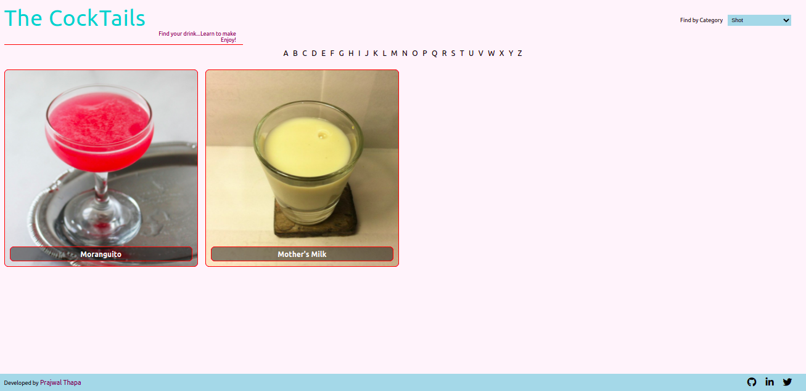

# The Cocktails DB

>This the the capstone project for the react-redux module of [Microverse](https://www.microverse.org/) main technical curriculum.  
>In this project I have fetched the data from [The Cocktails DB](https://www.thecocktaildb.com/) API and presented in the app.
>The users can look for various drinks according to the first alphabet of its name in the main page. Also the users can use the available filters to filter the drink categories such as cocktails, ordinary drinks, shots, and others.
>Users can see the details of a particular drink by clicking its name.
<div align="center">

[](https://github.com/praz99/react-capstone)
[](https://github.com/praz99/react-capstone/issues)
[](https://github.com/praz99/react-capstone/pulls)

</div>

## 📝 Contents

<p align="center">
<a href="#with">Built with</a>&nbsp;&nbsp;&nbsp;|&nbsp;&nbsp;&nbsp;
<a href="#ll">Live Demo Link</a>&nbsp;&nbsp;&nbsp;|&nbsp;&nbsp;&nbsp;
<a href="#gs">Getting started</a>&nbsp;&nbsp;&nbsp;|&nbsp;&nbsp;&nbsp;
<a href="#author">Author</a>
</p>

## 🔧 Built with<a name = "with"></a>
- ReactJS
- React-Redux
- HTML 5 and CSS 3

## Screenshots





## Live Demo Link <a name = "ll"></a>

## See Live
See live on [Heroku](https://praz-cocktailsdb.herokuapp.com/)


## Getting Started <a name = "gs"></a>
This project was bootstrapped with [Create React App](https://github.com/facebook/create-react-app).

Make sure you have [Node](https://nodejs.org/en/), installed in your computer.   
Install [yarn](https://yarnpkg.com/getting-started/install). (or you can still use ```npm``` instead of ```yarn```.)

To get a local copy of the repository please run the following commands on your terminal:

```
$ git clone git@github.com:praz99/react-capstone.git
```
```
$ cd react-capstone
```

```
$ yarn install
```
```
$ yarn start
```

This runs the app in the development mode.
Open [http://localhost:3000](http://localhost:3000) to view it in the browser.

## Testing
This app has been tested using the ```react-testing-library```.
Run ```yarn test``` in the console to run the tests.

## ✒️  Authors <a name = "author"></a>

👤 **Prajwal Thapa**

- Github: [praz99](https://github.com/praz99)
- Twitter: [@thapa_praz](https://twitter.com/thapa_praz)
- LinkedIn: [prazwal-thapa](https://linkedin.com/in/prazwal-thapa)
- Email: t.prazwal@gmail.com

## 🤝 Contributing

Contributions, issues and feature requests are welcome!

Feel free to check the [issues page](https://github.com/praz99/react-capstone/issues).


## 👍 Show your support

Give a ⭐️ if you like this project!

## :clap: Acknowledgements
- [The Cocktails DB](https://www.thecocktaildb.com/)
- [Microverse](https://www.microverse.org/)

## 📝 License

This project is [MIT](./LICENSE) licensed.
